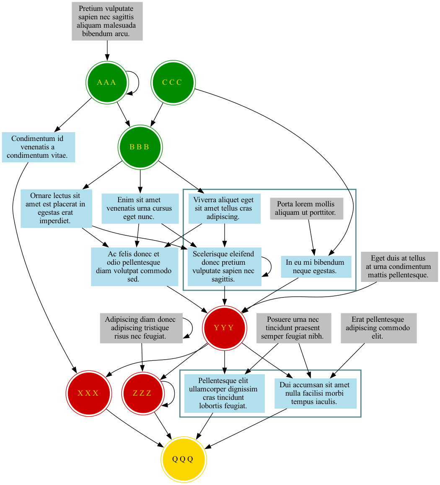
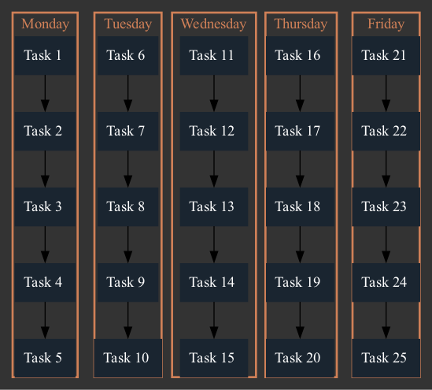
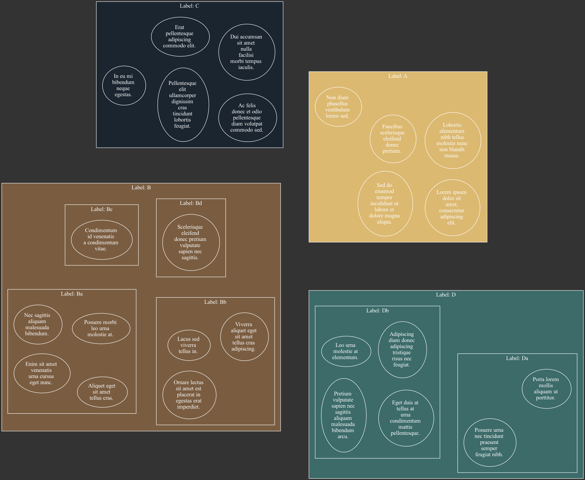

# [graphviz-templates](https://github.com/cb-g/graphviz-templates)

## [digraphs](https://github.com/cb-g/graphviz-templates/tree/main/digraphs)

### [digraph01.py](https://github.com/cb-g/graphviz-templates/blob/main/digraphs/digraph01.py)

[digraph01.gv.pdf](https://github.com/cb-g/graphviz-templates/blob/main/digraphs/digraph01.gv.pdf)

### [digraph02.py](https://github.com/cb-g/graphviz-templates/blob/main/digraphs/digraph02.py)

[digraph02.gv.pdf](https://github.com/cb-g/graphviz-templates/blob/main/digraphs/digraph02.gv.pdf)

## [graphs](https://github.com/cb-g/graphviz-templates/tree/main/graphs)

### [graph01.py](https://github.com/cb-g/graphviz-templates/blob/main/graphs/graph01.py)

[graph01.gv.pdf](https://github.com/cb-g/graphviz-templates/blob/main/graphs/graph01.gv.pdf)

