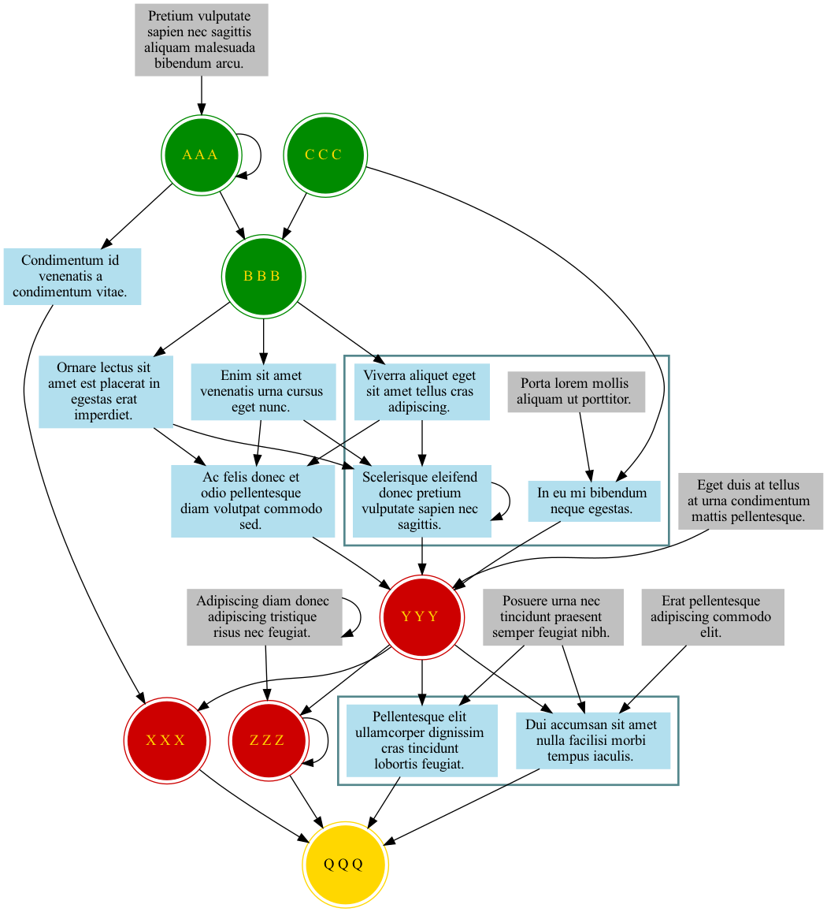

# [graphviz-templates](https://github.com/cb-g/graphviz-templates)

## [digraphs](https://github.com/cb-g/graphviz-templates/tree/main/digraphs)

### [digraph00.py](https://github.com/cb-g/graphviz-templates/blob/main/digraphs/digraph00.py)

[digraph00.gv.pdf](https://github.com/cb-g/graphviz-templates/blob/main/digraphs/digraph00.gv.pdf)

## [graphs](https://github.com/cb-g/graphviz-templates/tree/main/graphs)

### [graph00.py](https://github.com/cb-g/graphviz-templates/blob/main/graphs/graph00.py)

[graph00.gv.pdf](https://github.com/cb-g/graphviz-templates/blob/main/graphs/graph00.gv.pdf)

